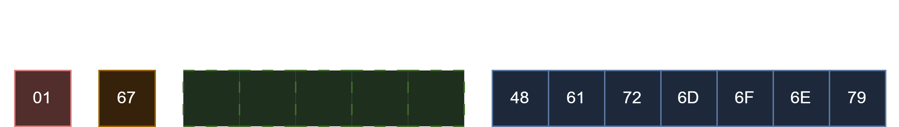

# About

Harmony Binary Protocol (HBP) is a general purpose serialization protocol inspired by the protocols like Bolt's PackStream and Redis's RESP3, that aims to provide a standardized type aware way to serialize and deserialize data.

It consists of a set of basic types, composite types, and meta types that together allow you to represent data in the way you need.

# Table of Contents

- [About](#about)
- [Table of Contents](#table-of-contents)
- [Representation](#representation)
- [Basic Data Types](#basic-data-types)
  - [Null](#null)
  - [Bool](#bool)
  - [Numbers](#numbers)
    - [Signed Integers](#signed-integers)
    - [Unsigned Integers](#unsigned-integers)
    - [Floats](#floats)
    - [Decimals](#decimals)
  - [Strings](#strings)
- [Meta Data Types](#meta-data-types)
  - [Optional](#optional)
  - [Enum](#enum)
  - [Error](#error)
- [Composite Data Types](#composite-data-types)
  - [Array](#array)
  - [List](#list)
  - [Dictionary](#dictionary)
  - [Map](#map)
- [Cheat Sheet](#cheat-sheet)

# Representation

Every serialized HBP value begins with the HBP version used to encode it followed by a marker that represents the type of the data.

Some markers might use up to 5 extra bytes to indicate certain information about the data it represents.



# Basic Data Types

Basic types (or primitives) are the fundamental blocks used to represent the encoded data.

## Null

Marker: `00`

`null` represents the absence of a value and therefor has no data bytes.

## Bool

Markers:
- false: `01`
- true: `02`

Booleans are encoded as their respective single byte and have no data bytes.

## Numbers

### Signed Integers

Fixed size integers:

| Marker | Data Size (bytes) | Zig Type |
| :----: | :---------------: | :------: |
|  `10`  |         1         |   `i8`   |
|  `11`  |         2         |  `i16`   |
|  `12`  |         4         |  `i32`   |
|  `13`  |         8         |  `i64`   |
|  `14`  |        16         |  `i128`  |
|  `15`  |        32         |  `i256`  |
|  `16`  |        64         |  `i512`  |

Arbitrary size integers:

Marker: `1F`

Arbitrary sized integers are followed by `2` bytes designating their bit-width, however serializers should always aim to byte align the size.

### Unsigned Integers

Fixed size integers:

| Marker | Data Size (bytes) | Zig Type |
| :----: | :---------------: | :------: |
|  `20`  |         1         |   `u8`   |
|  `21`  |         2         |  `u16`   |
|  `22`  |         4         |  `u32`   |
|  `23`  |         8         |  `u64`   |
|  `24`  |        16         |  `u128`  |
|  `25`  |        32         |  `u256`  |
|  `26`  |        64         |  `u512`  |

Arbitrary size integers:

Marker: `2F`

Arbitrary sized integers are followed by `2` bytes designating their bit-width, however serializers should always aim to byte align the size.

### Floats

| Marker | Data Size (bytes) |                                                     Type                                                      |
| :----: | :---------------: | :-----------------------------------------------------------------------------------------------------------: |
|  `30`  |         2         |      [IEEE 754 Half precision float](https://en.wikipedia.org/wiki/Half-precision_floating-point_format)      |
|  `31`  |         3         |                         [IEEE 754 Minifloat](https://en.wikipedia.org/wiki/Minifloat)                         |
|  `32`  |         4         |    [IEEE 754 Single precision float](https://en.wikipedia.org/wiki/Single-precision_floating-point_format)    |
|  `33`  |         5         |             [IEEE 754 Extended precision float](https://en.wikipedia.org/wiki/Extended_precision)             |
|  `34`  |         8         |    [IEEE 754 Double precision float](https://en.wikipedia.org/wiki/Double-precision_floating-point_format)    |
|  `35`  |        10         |             [IEEE 754 Extended precision float](https://en.wikipedia.org/wiki/Extended_precision)             |
|  `36`  |        16         | [IEEE 754 Quadruple precision float](https://en.wikipedia.org/wiki/Quadruple-precision_floating-point_format) |
|  `37`  |        32         |   [IEEE 754 Octuple precision float](https://en.wikipedia.org/wiki/Octuple-precision_floating-point_format)   |
|  `3F`  |         2         |             [Brain Floating Point](https://en.wikipedia.org/wiki/Bfloat16_floating-point_format)              |

### Decimals

| Marker | Data Size (bytes) |                                         Type                                          |
| :----: | :---------------: | :-----------------------------------------------------------------------------------: |
|  `3A`  |         4         |  [IEEE 754 Decimal32](https://en.wikipedia.org/wiki/Decimal32_floating-point_format)  |
|  `3B`  |         8         |  [IEEE 754 Decimal64](https://en.wikipedia.org/wiki/Decimal64_floating-point_format)  |
|  `3C`  |        16         | [IEEE 754 Decimal128](https://en.wikipedia.org/wiki/Decimal128_floating-point_format) |

# Meta Data Types

Meta data types are special types that acts as metadata for other types and they usually take up at least 2 bytes, the first byte being the meta type itself and the second one being the marker for the inner type.

HBP reserves all the `E0-FF` range for meta types.

## String

Marker: `E0`

Strings are `UTF-8` encoded lists of bytes. 

The string marker is always followed by a list marker with the the type byte set to `20` (u8), the byte marker can also be omitted as deserializers can infer the type from the string meta type.

## Vector

Marker: `E3`

The vector marker must **always** be followed by a list marker to indicate the size and type of the vector, the data should follow the same encoding as the indicated type.

## Optional

Marker: `F0`

This marker is used as an indicator that the following marker can either be [`null`](#null) or another type.

## Enum

Marker: `F1`

The enum marker must **always** be followed by an integer marker to indicate the maximum size of the enum, the data should follow the same encoding as the indicated type.

## Error

Marker: `FF`

Example:

```txt
Original: Error("This failed")

Serialized: 01 FF 6B 54 68 69 73 20 46 61 69 6C 65 64
```

# Composite Data Types

## Array

Small arrays:

| Marker | Array size |
| :----: | :--------: |
|  `70`  |     0      |
|  `71`  |     1      |
|  `72`  |     2      |
|  `73`  |     3      |
|  `74`  |     4      |
|  `75`  |     5      |
|  `76`  |     6      |
|  `77`  |     7      |
|  `78`  |     8      |
|  `79`  |     9      |
|  `7A`  |     10     |
|  `7B`  |     11     |
|  `7C`  |     12     |
|  `7D`  |     13     |
|  `7E`  |     14     |
|  `7F`  |     15     |

Long arrays:

| Marker | Extra bytes | Maximum Size  |
| :----: | :---------: | :-----------: |
|  `DA`  |      1      |      255      |
|  `DB`  |      2      |    65_535     |
|  `DC`  |      4      | 4_294_967_295 |

An array is a list of values, each one serializing their own type alongside like a basic hbp payload. If its a long array, the length will come **after** the value type.

```txt
Original: [3, 6, 9]

Serialized: 01 73 10 03 10 06 10 09
```


## List

Small lists:

| Marker | List Size |
| :----: | :-------: |
|  `80`  |     0     |
|  `81`  |     1     |
|  `82`  |     2     |
|  `83`  |     3     |
|  `84`  |     4     |
|  `85`  |     5     |
|  `86`  |     6     |
|  `87`  |     7     |
|  `88`  |     8     |
|  `89`  |     9     |
|  `8A`  |    10     |
|  `8B`  |    11     |
|  `8C`  |    12     |
|  `8D`  |    13     |
|  `8E`  |    14     |
|  `8F`  |    15     |

Long lists:

| Marker | Extra bytes | Maximum Size  |
| :----: | :---------: | :-----------: |
|  `DD`  |      1      |      255      |
|  `DE`  |      2      |    65_535     |
|  `DF`  |      4      | 4_294_967_295 |

A list as the name indicates is a list of values where all the values have the same type which has to be indicated right after the list marker. If its a long list, the length will come **after** the value type.

```txt
Original: List([3, 6, 9])

Serialized: 01 83 10 03 06 09
```

## Dictionary

| Marker | Extra bytes | Maximum Size  |
| :----: | :---------: | :-----------: |
|  `D0`  |      1      |      255      |
|  `D1`  |      2      |    65_535     |
|  `D2`  |      4      | 4_294_967_295 |

A dictionary is a key-value store where all the keys are strings.

The encoding of a dictionary is as follows:

```txt
<marker> <size> (<string_marker> <string_data> <value_marker> <value_data>)*size
```

> [!NOTE]
> A dictionary's size is the amount of kv pairs not the sum of keys and values.

## Map

| Marker | Extra bytes | Maximum Size  |
| :----: | :---------: | :-----------: |
|  `D3`  |      1      |      255      |
|  `D4`  |      2      |    65_535     |
|  `D5`  |      4      | 4_294_967_295 |

A map is just like a dictionary but instead, the keys can be of any type.

# Cheat Sheet

| Marker  |                   Name                   |                Type                |
| :-----: | :--------------------------------------: | :--------------------------------: |
|  `00`   |             [`null`](#null)              |   [Primitive](#basic-data-types)   |
|  `01`   |             [`false`](#bool)             |   [Primitive](#basic-data-types)   |
|  `02`   |             [`true`](#bool)              |   [Primitive](#basic-data-types)   |
| `10-16` |   [`signed integer`](#signed-integers)   |   [Primitive](#basic-data-types)   |
|  `1F`   |   [`signed integer`](#signed-integers)   |   [Primitive](#basic-data-types)   |
| `20-26` | [`unsigned integer`](#unsigned-integers) |   [Primitive](#basic-data-types)   |
|  `2F`   | [`unsigned integer`](#unsigned-integers) |   [Primitive](#basic-data-types)   |
| `30-37` |            [`float`](#floats)            |   [Primitive](#basic-data-types)   |
| `3A-3C` |           [`decimal`](#floats)           |   [Primitive](#basic-data-types)   |
|  `3F`   |          [`bfloat16`](#floats)           |   [Primitive](#basic-data-types)   |
| `70-7F` |            [`array`](#array)             | [Composite](#composite-data-types) |
| `80-8F` |             [`list`](#list)              | [Composite](#composite-data-types) |
| `D0-D2` |       [`dictionary`](#dictionary)        | [Composite](#composite-data-types) |
| `D3-D5` |              [`map`](#map)               | [Composite](#composite-data-types) |
| `DA-DC` |            [`array`](#array)             | [Composite](#composite-data-types) |
| `DD-DF` |             [`list`](#list)              | [Composite](#composite-data-types) |
|  `E0`   |           [`string`](#string)            |      [Meta](#meta-data-types)      |
|  `F0`   |         [`optional`](#optional)          |      [Meta](#meta-data-types)      |
|  `F1`   |             [`enum`](#enum)              |      [Meta](#meta-data-types)      |
|  `FF`   |            [`error`](#error)             |      [Meta](#meta-data-types)      | ` |